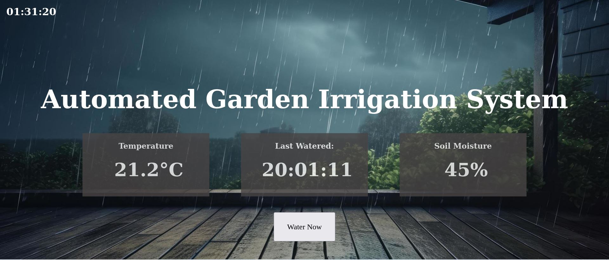

# Automated-Garden-Irrigation
An automated garden irrigation system powered by a Beaglbone Green board.

The system uses the LM35 temperature sensor and a capacitive soil moisture sensor connected to the board's GPIO pins to determine when to water the plant. 
Plant watering is controlled by a 5V relay connected to a submersible DC pump. 
All data is being displayed on a web page in real time (1 sec refresh rate).  
The webpage includes a "water now" button so the user can manually water the plant. 

